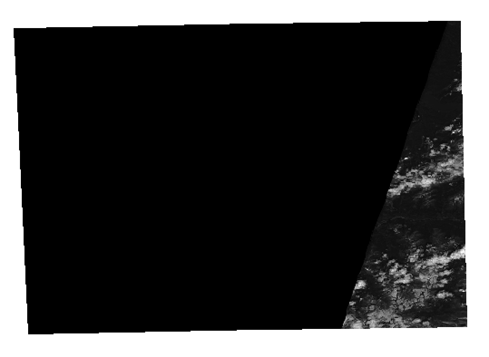
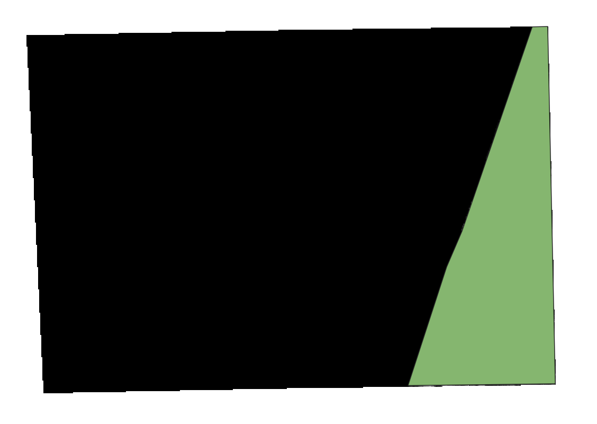
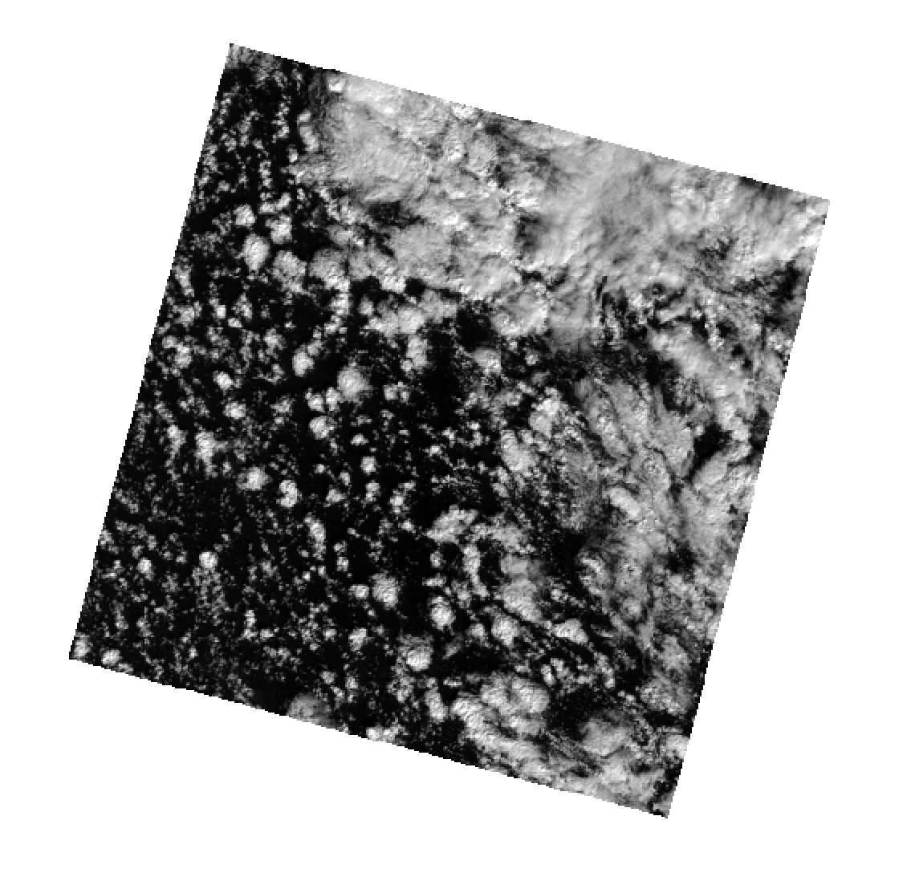
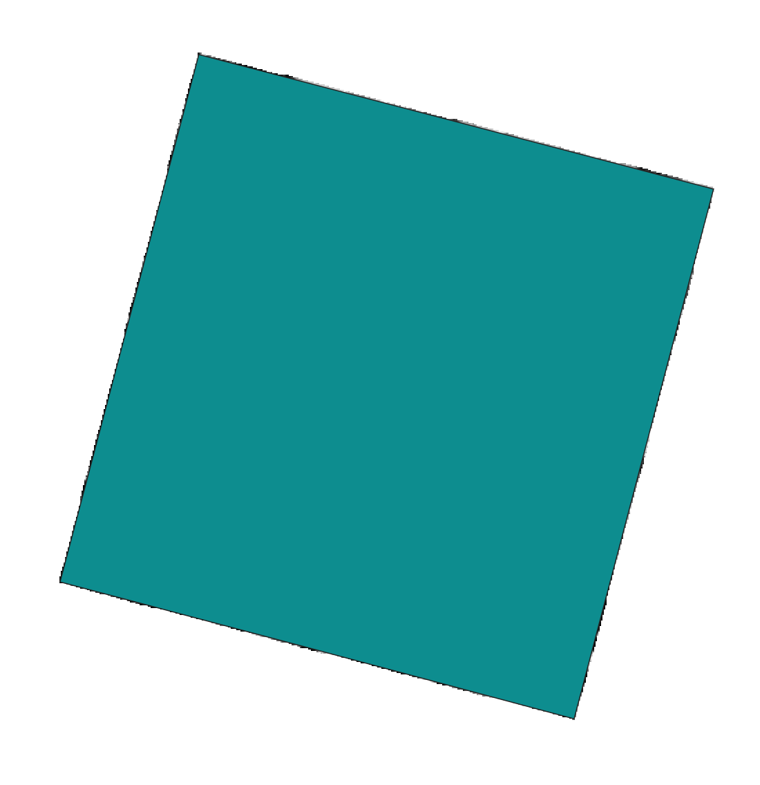
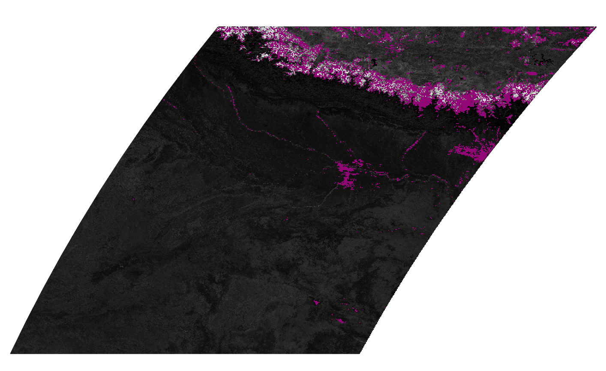

Determining Footprints from Raster Data
=======================================

When creating STAC Item records from raster images, one important action is
generating a spatial footprint of the image data to use for the Item geometry
field. We intentionally use the imprecise term "footprint" here,
as we are not trying to create a precise vector representation of the data of
an image (which could contain as many
polygons as pixels in the image!), but we are trying to do better than just a
bounding box of the entire image, both
data and no data. By footprint, we mean a vector that balances many competing
factors, and generally represents a shape
covering the data in an image. Figuring out the right parameter values to the
methods in the :mod:`~stactools.core.utils.raster_footprint`
module will usually require some experimental validation, to find exactly the
right values for your data, CRS, and
use cases.

There are a few properties we'd like to have in a footprint:

#. The footprint only covers the area on the image only where there is data.
#. The footprint has enough points to accurately capture the shape of the data
   in the EPSG:4326 CRS used by GeoJSON.
#. The footprint does not have too many points, such that it is becomes very
   large.

Discussion of these properties follows.

Only Data Areas are Represented
-------------------------------

Typically, gridded imagery will have image files representing a single grid
square, with no data values
where there is no data. There are many reasons why an image may contain no
data values, and we will describe a few of them here.

In the Sentinel-2 L2A product, many images only have
a partial swath of data where an orbit of the sensor only captured data
within part of a single grid square.

Ideally, our footprint generated from this image would not cover the
entire image, but only the area where there is data, like this:

In the Landsat 8 product, the data area appears rotated, as the orbit
of the satellite and path-row gridding is not aligned with the CRS.

We'd like the footprint to only cover that data area, and not the
no data areas that square the image:

Another issue is products that use no data values for areas where
clouds, snow, or ice exist. A precise vector representation of
such an image would likely be a MultiPolygon with holes where the
no data values are. However, this is rarely useful for STAC use cases.

Likewise, where an area of no data values coincide with one of
of the edges of the image, we could attempt to create a concavity to
carve out the no data pixels through the
calculation of the alpha shape. Instead, we
take an easier approach and create a convex hull around the data
areas of the image. In practice, the difference in
coverage between the convex hull and the alpha shape is relatively
small. This difference has the potential to
result in false positives where a search geometry intersects the
geometry of an Item, but the only pixels within the
geometry are no data, but in practice this is rarely a problem.

When using the :mod:`~stactools.core.utils.raster_footprint` functions, the
``no_data`` parameter value can be used to pass in the value
used for no data if it is not defined in the image metadata.

Reprojected Geometry Accurately Represents the Footprint
--------------------------------------------------------

In the native CRS, the geometry of the data area of an image can
typically be represented by a polygon containing a
small number of points. If the entire image has data pixels, it
maybe represented by a 5 point polygon (where the
first and last points are the same). When this polygon is reprojected
to EPSG:4326, it will still result in a 5 point
polygon, as the points have simply been reprojected into the new CRS.
This new polygon may not accurately represent
original polygon if there is significant curved distortion between
the CRSs. An example of this is most apparent in
reprojecting the sinusoidal geometry of MODIS to EPSG:4326. Simply
reprojecting the 5 point polygon would result in
a parallelogram, whereas a more accurate representation is two
parallel straight sides and two curved sides.

To increase the accuracy of the reprojected shape, we can first
densify the polygon. Here we add additional, redundant
points between existing points in the polygon, so that the
reprojected shape will have points that more closely match
the actual form of the reprojection. In the above example for
MODIS, we have used a densification factor of 10, so that
each "side" of the polygon has 11 points representing it instead
of 2, and we get a "curved" side that more closely
matches the raster reprojection.

When using the methods in the :mod:`~stactools.core.utils.raster_footprint`
module, the ``densification_factor`` or ``densification_distance`` parameter
can be used to densify the geometry before reprojection. This will require some
experimentation to find the appropriate value for the CRS of your data.

Simplifying the Geometry
-------------------------------

A 4801 point polygon is required to precisely represent a MODIS tile
in EPSG:4326 to accurately represent itself, as
it is a 2400x2400 pixel image and two sides are curves after reprojection.
However, a polygon this dense both makes
the Item body very large and increases the computation required to perform
an intersects calculation during search,
with little benefit. These polygons can be simplified by defining a maximum
distance, in degrees, within which the simplified polygon must be to original
polygon points. This is also useful when the polygon in the native
CRS has a large number of points, so
that the end result is a polygon of a more manageable size.

When using the methods in the :mod:`~stactools.core.utils.raster_footprint`
module, the ``simplify_tolerance`` parameter defines the distance within which
the simplified polygon must be to the original polygon points. This will
require some experimentation to find the appropriate value for the CRS of your
data.
